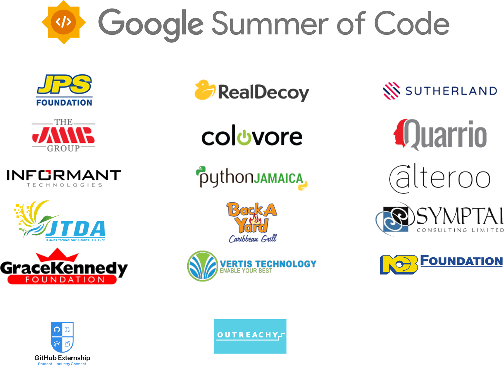

The [Palisadoes Foundation’s](https://www.palisadoes.org) open-source software projects started in 2016 when a group of expatriate Jamaicans wanted to assist development of new and existing information technologies for the island’s social good.

A significant proportion of our original open source contributions came from university students studying software engineering. Participants often came from under-served communities or geographic areas and were sponsored through the various programs in which we participated.

## Sponsors

We appreciate the work of our sponsors over the years.

